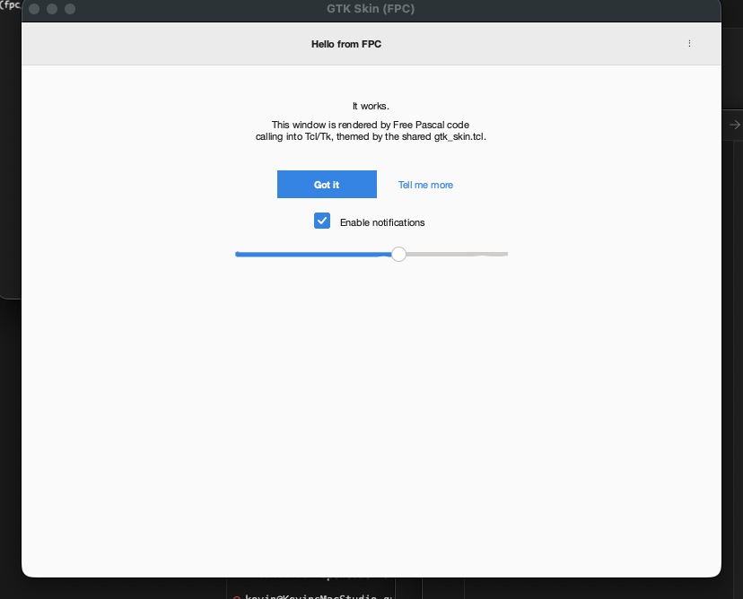
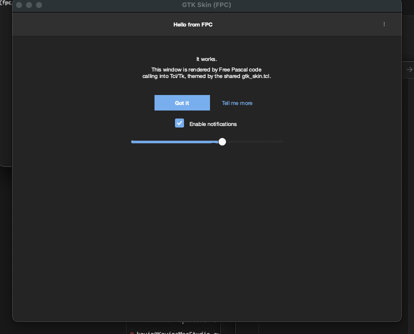
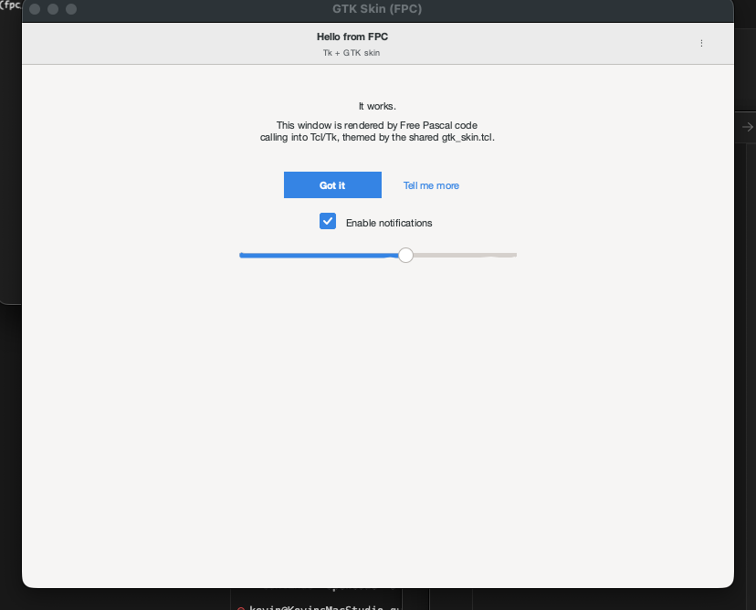

# freepascal_tk_gtk3_gtk4 — Free Pascal bindings for Tcl/Tk with a GTK3/GTK4 skin

Direct FFI bindings from [Free Pascal](https://www.freepascal.org) to Tcl 8.6 + Tk 8.6, plus a shared Tcl skin that makes a plain Pascal app look like a modern GNOME application.

No Lazarus, no LCL — just `fpc`, an embedded Tcl/Tk interpreter, and a 1000-line Tcl skin file.

<p align="center">
  
  
</p>

<p align="center">
  
</p>

## Features

- **`TclTkBindings` unit** — raw `external` declarations for `libtcl8.6` / `libtk8.6`: interpreter lifecycle, `Tcl_Eval`, `Tcl_GetString`, `Tcl_CreateObjCommand`, `Tk_MainLoop`.
- **`TkGtkSkin` unit** — friendly `TTkApp` class that wraps interpreter setup, raises `TkError` exceptions on Tcl errors, registers Pascal methods as Tcl commands, and exposes convenience widget constructors.
- **Pascal → Tcl callbacks** via `app.Cmd(name, method)` or `app.OnClick(method)` — any `procedure of object` can be invoked from button `-command` handlers.
- **Shared GTK skin** in pure Tcl (`resources/gtk_skin.tcl`) — the same file used by the sibling [Python](https://github.com/KellerKev/python_tk_gtk3_gtk4) and [Nim](https://github.com/KellerKev/nim_tk_gtk3_gtk4) ports.
- **Project-local Free Pascal toolchain** bootstrapped by `pixi run setup` — no Homebrew, no `.pkg` installer, no admin password. Works on machines without any prior Pascal tooling.

## Quick start

```bash
git clone https://github.com/KellerKev/freepascal_tk_gtk3_gtk4
cd freepascal_tk_gtk3_gtk4
pixi run setup    # one-time: downloads + relocates FPC 3.2.2 into .local-fpc/ (~30s)
pixi run demo     # GTK4 libadwaita (default)
pixi run demo-dark
pixi run demo3    # GTK3 Adwaita
```

Use it in your own Pascal program:

```pascal
program myapp;
{$mode objfpc}{$H+}
uses TkGtkSkin;

type
  TMain = class
    App: TTkApp;
    procedure HandleSave;
  end;

procedure TMain.HandleSave;
begin
  WriteLn('saved!');
end;

var
  m: TMain;
  saveCmd: string;
begin
  m := TMain.Create;
  m.App := TTkApp.Create(Gtk4, False, 'Hello', 480, 240);

  m.App.HeaderBar('.hb', 'Preferences');
  m.App.Eval('pack .hb -fill x');

  saveCmd := m.App.OnClick(@m.HandleSave);
  m.App.Eval('ttk::button .b -text Save -style Suggested.TButton -command ' + saveCmd);
  m.App.Eval('pack .b -pady 20');

  m.App.Run;
end.
```

## Architecture

```
freepascal_tk_gtk3_gtk4/
├── pixi.toml                           tk + curl + xz + jq deps
├── scripts/
│   ├── setup-fpc.sh                    Bootstrap FPC bottle from ghcr.io → .local-fpc/
│   ├── build.sh                        fpc compile wrapper with -rpath baking
│   └── shot.sh                         Screenshot helper
├── resources/gtk_skin.tcl              Language-agnostic GTK skin
└── src/
    ├── lib/
    │   ├── TclTkBindings.pas           Raw FFI to libtcl/libtk
    │   └── TkGtkSkin.pas               High-level TTkApp class + widget constructors
    ├── demo.pas                        4-tab preferences demo w/ live theme switching
    └── shot.pas                        "Hello from FPC" smoke test / screenshot app
```

### The bindings ([src/lib/TclTkBindings.pas](src/lib/TclTkBindings.pas))

Declares only what the high-level API needs, as plain `external` procs:

```pascal
function  Tcl_CreateInterp(): PTclInterp; cdecl; external TCL_LIB;
function  Tcl_Init(interp: PTclInterp): cint; cdecl; external TCL_LIB;
function  Tk_Init(interp: PTclInterp): cint; cdecl; external TK_LIB;
function  Tcl_Eval(interp: PTclInterp; script: PChar): cint; cdecl; external TCL_LIB;
function  Tcl_GetStringResult(interp: PTclInterp): PChar; cdecl; external TCL_LIB;
function  Tcl_GetString(objPtr: PTclObj): PChar; cdecl; external TCL_LIB;
procedure Tcl_SetResult(interp: PTclInterp; msg: PChar; freeProc: Pointer); cdecl; external TCL_LIB;
function  Tcl_CreateObjCommand(...): Pointer; cdecl; external TCL_LIB;
procedure Tk_MainLoop(); cdecl; external TK_LIB;
```

Library names differ per platform (handled via `{$IFDEF DARWIN/LINUX/WINDOWS}`). Linking is done via `scripts/build.sh` which passes `-rpath $CONDA_PREFIX/lib` through the fpc linker options so the binary finds `libtcl8.6.dylib` / `libtk8.6.dylib` at runtime without needing `DYLD_LIBRARY_PATH`.

### The high-level API ([src/lib/TkGtkSkin.pas](src/lib/TkGtkSkin.pas))

```pascal
type
  TGtkStyle = (Gtk3, Gtk4);
  TkError = class(Exception);
  TTkCallback = function(const args: array of string): string of object;

  TTkApp = class
  public
    constructor Create(style: TGtkStyle; dark: Boolean;
                       const title: string; width, height: Integer);
    function  Eval(const script: string): string;
    procedure EvalFile(const path: string);
    function  Cmd(const name: string; fn: TTkCallback): string;
    function  OnClick(fn: TProcedure): string;
    procedure ApplySkin(style: TGtkStyle; dark: Boolean);
    procedure Run;

    procedure HeaderBar(const path, title: string; const subtitle: string = '');
    procedure Switch(const path: string; const variable: string = '';
                     const command: string = '');
    procedure PillButton(const path, text: string; const kind: string = 'accent';
                         const command: string = '');
    procedure Radio(const path, text, variable, value: string;
                    const command: string = '');
    procedure Check(const path, text, variable: string;
                    const command: string = '');
    procedure Scale(const path: string; fromVal, toVal, value: Double;
                    length: Integer = 220; const variable: string = '';
                    const command: string = '');
    procedure Avatar(const path, text: string; size: Integer = 40;
                     const color: string = '');
  end;
```

## How the setup works

`scripts/setup-fpc.sh` does something slightly unusual: it fetches the pre-built **Homebrew bottle** for `fpc` directly from `ghcr.io/v2/homebrew/core/fpc` using the anonymous OCI distribution token flow. Homebrew bottles are just OCI-layout tarballs with a known internal structure. The script:

1. Calls `https://formulae.brew.sh/api/formula/fpc.json` to look up the right bottle URL for the current macOS version (`arm64_tahoe`, `arm64_sequoia`, etc.).
2. Fetches an anonymous auth token from `ghcr.io/token?scope=repository:homebrew/core/fpc:pull`.
3. Downloads the tarball.
4. Extracts to `.local-fpc/`.
5. Rewrites `/opt/homebrew/Cellar/fpc/<ver>` paths in the embedded `fpc.cfg` to point at `$FPC_HOME` instead.

The result: Free Pascal installed into a project-local directory in ~30 seconds with no Homebrew, no `.pkg` installer, no sudo.

## Prerequisites

- macOS (Apple Silicon or Intel) or Linux
- [pixi](https://pixi.sh) — installs Tcl/Tk into the pixi env and runs the FPC bootstrap

Nothing else needs to be pre-installed.

## Gotchas

Three non-obvious things came up while porting the skin to Free Pascal:

### 1. FP exception masks crash AppKit on macOS

FPC's RTL enables floating-point exception traps by default (invalid-operation, divide-by-zero, overflow, underflow, denormal, precision). AppKit's `_NSGetCGFloatAppConfig` (called during the first `NSWindow` creation from `Tk_Init`) performs FP operations that produce NaNs/denormals on its normal code path. With FPC's traps active, those operations raise `EXC_BAD_INSTRUCTION` and the program crashes inside `Tk_Init` before any window appears.

Python and Nim don't hit this because their runtimes leave the FP mask at the system default. **`TTkApp.Create` explicitly disables all FP traps at startup** via:

```pascal
SetExceptionMask([exInvalidOp, exDenormalized, exZeroDivide,
                  exOverflow, exUnderflow, exPrecision]);
```

This is the single most important thing in the entire project if you're trying to call Tk from an FPC binary on macOS. Without it: instant crash during `Tk_Init`. With it: everything works.

### 2. `Tcl_Obj *const *` can't be expressed in Pascal

C's `Tcl_ObjCmdProc` signature uses `Tcl_Obj *const *` for `objv`. Pascal has no exact equivalent (we can't qualify the pointer constness separately from the target type). The binding types `objv` as `Pointer` and provides `TclObjAt(objv, i): PTclObj` for indexing:

```pascal
function TclObjAt(objv: Pointer; i: Integer): PTclObj;
var arr: ^PTclObj;
begin
  arr := objv;
  Result := (arr + i)^;
end;
```

The `prc` and `deleteProc` parameters of `Tcl_CreateObjCommand` are also typed as `Pointer` rather than a specific function signature, for the same reason.

### 3. Command-line Pascal binaries don't get window focus on macOS

Without a `.app` bundle, newly-spawned Tk windows from a terminal-launched FPC binary don't automatically come to the foreground or receive keyboard focus. The demo calls `wm attributes . -topmost 1; after 200 {wm attributes . -topmost 0}` at startup to force the window above other apps briefly. For a real shipping app you'd bundle the binary inside a `.app` directory with an `Info.plist`.

## Development

```bash
pixi run setup    # one-time, ~30s (downloads bottle + relocates)
pixi run build    # fpc → build/demo
pixi run demo     # runs build/demo
pixi run clean    # wipes build/
```

The build command includes `-rpath $CONDA_PREFIX/lib` so the resulting binary finds `libtcl8.6.dylib` / `libtk8.6.dylib` at runtime without needing `DYLD_LIBRARY_PATH`. You can copy `build/demo` + `resources/gtk_skin.tcl` anywhere and run it, provided the target machine has the same pixi env available (or you vendor the dylibs alongside).

## Related projects

Same GTK skin, different language bindings:

- [python_tk_gtk3_gtk4](https://github.com/KellerKev/python_tk_gtk3_gtk4) — Python tkinter version (native `ttk.Style` calls + Python widget classes).
- [nim_tk_gtk3_gtk4](https://github.com/KellerKev/nim_tk_gtk3_gtk4) — Nim bindings, same `resources/gtk_skin.tcl`.

The Nim and FPC projects source the exact same `gtk_skin.tcl` file — it was ported from Python once and is now doing triple duty.

## License

MIT.
